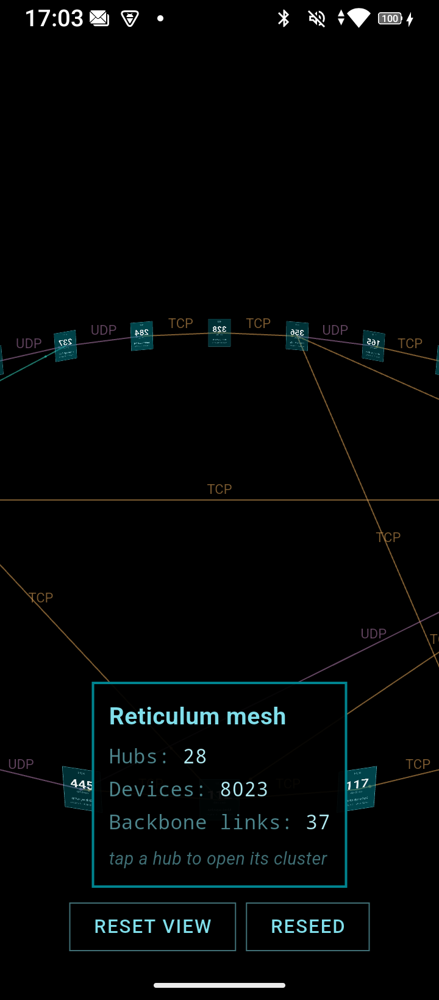
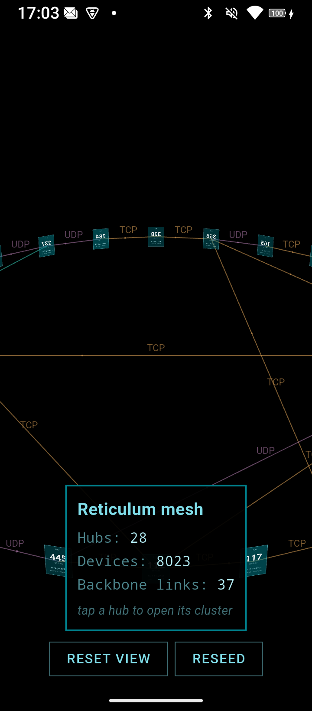
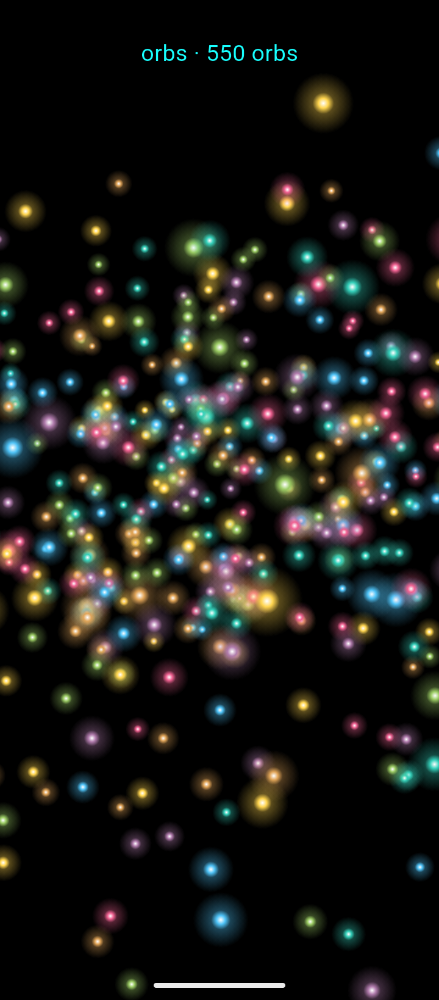
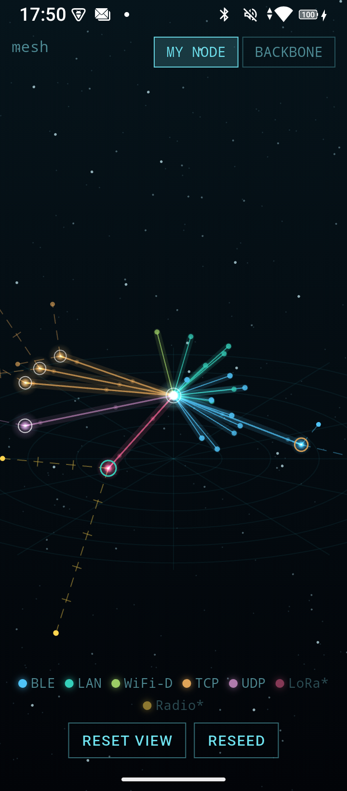
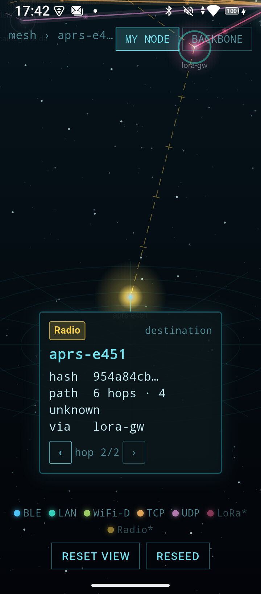
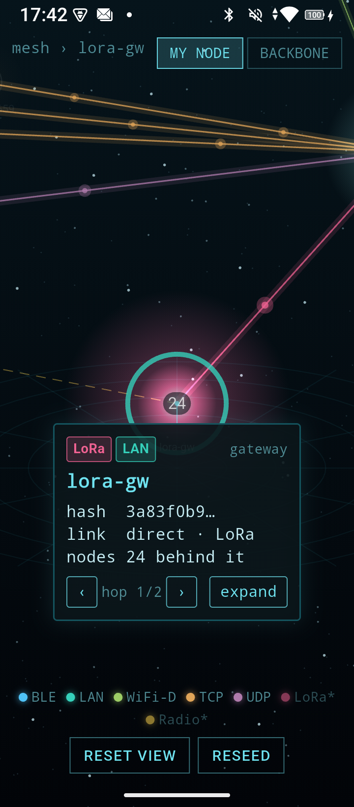
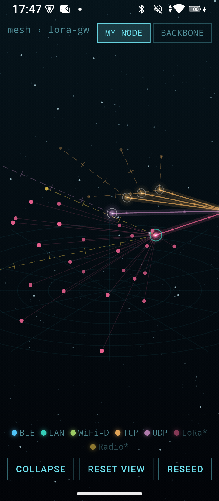
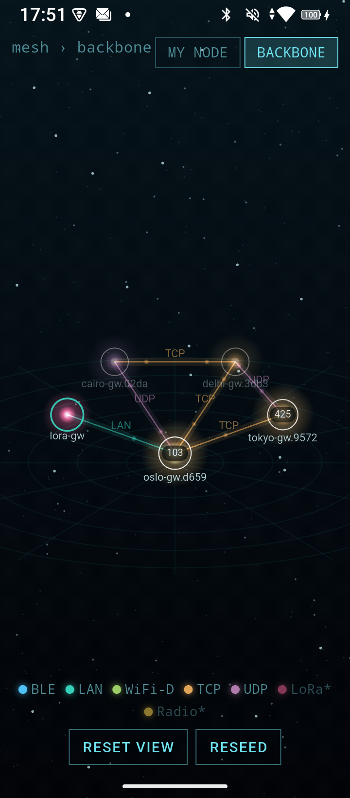
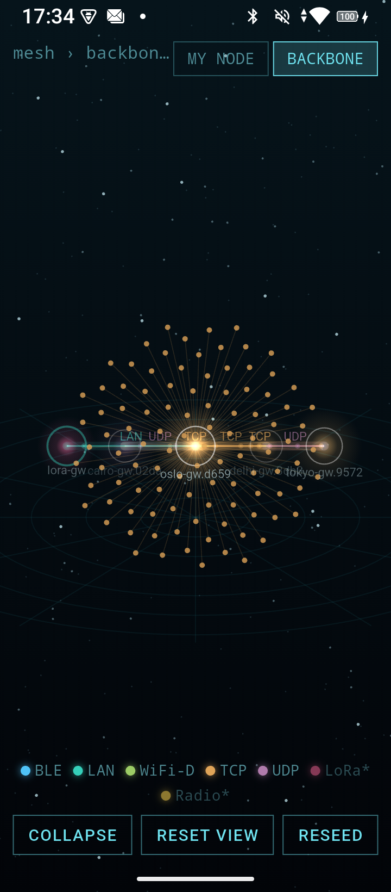
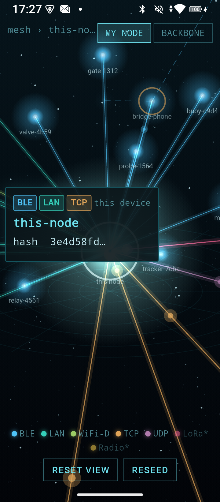

# Visualizing a Reticulum network in 3D — analysis and redesign

All measurements and screenshots in this document come from an Oukitel C61
(Android 15, arm64, 90Hz, 720x1640), release builds, driven over adb. The
workstation only ran `flutter analyze` and unit tests.

## 1. Why the first version failed

The first mesh demo reused the card metaphor inherited from the TripleCheck
viewer: every network node a 120x160 rectangle of text, hubs on a flat ring,
thin unlit lines between them.

The problems, from the device screenshots:

- **Cards are the wrong shape for network nodes.** A file has six fields worth
  printing on its face; a mesh device has a hash and an interface. At overview
  distance the text is unreadable noise, and the far side of every ring showed
  **mirrored** card backs.
- **No depth.** Black void, no fog, no size hierarchy, no background
  reference. The 3D read as a flat diagram photographed at an angle.
- **No visual code for network type.** Interface names were tiny line labels;
  the user's core question — *what kind of link is this?* — took reading, not
  seeing.
- **Wrong topology.** A ring of hubs with backbone links is not what a
  Reticulum node knows (see §2), there were no bridges, and "hops" was a
  number in a panel rather than a visible structure.
- Perf was fine (72–91fps) — the failure was informational and aesthetic, not
  technical.

## 2. What a Reticulum node can actually see

Audited against reticulum-dart (`lib/src/services/reticulum/`):

- A path-table entry is `{dest hash, hops, via, nextHop}`
  (`rns_transport.dart:62-87`). `via` is the label of **this node's own**
  egress interface; `nextHop` is the id of the **first relay** (null =
  direct neighbour); `hops` is a scalar. **The intermediate relays of a
  multi-hop path are unknowable** — announces carry no per-hop trace.
- Hub-to-hub backbone links are invisible from one vantage point. An honest
  single-node view is a star: self → direct neighbours, and self → relay →
  *(hops−1 unknown)* → destination. A whole-network picture requires
  aggregating several nodes' tables.
- **Edge bridges are first-class** (`rns_transport.dart:96-106`): a node on a
  low-capacity edge network (BLE) and a core network (TCP) that forwards
  announces edge→core — the phone that puts a BLE mesh on the internet.
- Implemented interfaces: TCP (rank 2; WiFi-Direct 4), TCP-server (what makes
  a hub), UDP (2), LAN (3), BLE (1, `edge`). LoRa/RNode and packet radio
  exist in the wider RNS world but not yet in the Dart stack — shown
  forward-looking, marked `*` in the legend.
- Scale expectations: path LRU 2048, max 128 hops, passive-shed at 50
  announces/s. A visualization must assume thousands of destinations and
  render a bounded subset.

These truths drove three design decisions: the **ego view** is the primary
view (it is what live data can honestly fill); unknown path middles render as
**ghost segments** — dashed, one tick per unknowable hop — rather than
invented topology; and **aggregation** (one orb per hub crowd, expand on
demand) is the only honest answer to scale.

## 3. The redesign

**Nodes are glowing orbs, not cards.** One cached radial-gradient per
interface colour (white-hot centre → colour → transparent halo), billboarded
in screen space, sized by role: self 46 > hub 40 > gateway 34 > bridge 30 >
peer 22 > leaf 17. Hubs carry a white ring and a device-count badge; bridges
and gateways a second ring in their other network's colour. Text appears only
when earned: labels level-of-detail-gated by projected size with a hard
budget of the nearest 40, detail panels only on selection.

**Depth is manufactured deliberately**: distance fog (alpha falloff across
the scene's depth band), a static starfield-and-polar-grid backdrop (cached
picture, zero per-frame cost), glow lines built from layered strokes (no
blur), pulse particles streaming along live links, and a slow cinematic
drift when the scene is left alone.

**The ego view is the network as your node knows it.** Self at the centre;
direct neighbours on an inner shell, grouped into angular sectors by
interface (sector width ∝ √members, fixed order — so BLE is always one
region of the sky); relays, bridges and gateways on a second shell at the
eye line; destinations behind their relay at a radius proportional to hop
count, so distance-in-hops *is* distance-on-screen. Ghost dashes with hop
ticks connect relays to multi-hop destinations.

**The backbone view is the honest aggregate**, one toggle away: hubs on a
ring with interface-labeled glowing links. Shared node keys mean toggling
*morphs* the hubs between their ego and backbone positions instead of
teleporting them.

**Navigation is walkable.** Tap any orb: the camera flies to it, its whole
path back to self lights up, and a holographic panel (leader-lined to the
orb, bottom-docked on narrow screens) shows hash, interface chips, role,
hops with the unknown count, and the via-relay. `‹ ›` buttons walk the
camera stop-by-stop along the lit path. Aggregates expand in place — the
leaves burst out of their hub, any other open cluster folds home, one
cluster max, in either view. A breadcrumb tracks where you are; double-tap
and Esc unwind selection → cluster → framing. While a drag is in flight the
whole HUD — legend, buttons, breadcrumb — fades to a whisper and stops
eating touches, so the chrome never stands between a thumb and the world;
the camera itself runs hotter than stock OrbitControls (rotate 0.24 vs 0.1,
damping 0.18 vs 0.1) because thumb-flying wants eagerness, not reverence.

## 4. Engine work (library `graph3d`)

- `NodeSprite` descriptor + `SpriteCrowdPainter` (cull, far→near sort, fog,
  emphasis, badge pills, label LOD/budget) + `pickSprite` (projected-radius
  hit test, 24px finger floor, nearest-first, onTop priority).
- `Graph3DView.sprites(...)` constructor — the card pipeline is untouched
  (TripleCheck still passes its suite).
- `EdgeStyle` gained `glow`, `dashed`, `ticks`, `pulseCount` (all defaulted,
  card apps render identically).
- `sectorShellPoses` layout helper (golden-ratio scatter on a spherical
  patch).
- `OrbitCamera.flyToPoint` (billboards have no face to approach) and
  `idleDriftSpeed`.

## 5. Measured results

The step-0 spike settled the biggest unknown first: **550 full-size gradient
orbs raster in ~15ms on the C61 (68fps); flat circles in ~6ms** — so the
shader path shipped, with the halo LOD collapsing distant orbs to flat
stars.

Shipping numbers (release, `GRAPH3D_FRAME_STATS`):

| state | build p50/p95 | raster p50/p95 | fps |
|---|---|---|---|
| ego overview, idle (pulses animating) | 4.0 / 4.3 ms | 8.2 / 11.1 ms | 61–91 |
| hub cluster (≈400 leaves) expanding | 3.6 / 4.3 ms | 6.5 / 7.8 ms | 91 |
| cluster expanded, orbiting | 3.9 / 6.6 ms | 8.2 / 11.0 ms | 91 |
| LoRa cluster + path chain lit | 3.5 / 8.0 ms | 7.1 / 9.0 ms | 89–91 |

Graphics memory after cycling clusters and views: **22MB** (the sprite path
holds no textures at all — down from 42MB in the card version). Total PSS
116MB.

## 6. After

Ego overview — sectors by network type, ghost paths, the mesh at a glance:

A packet-radio destination selected: its chain lights, the panel reports
`6 hops · 4 unknown · via lora-gw`, and `‹ ›` walk the path:

The LoRa gateway's cluster expanded, hop shells in profile:

The backbone aggregate, and a hub's 400-device cluster:

Self selected — the node you are:

## 7. Known limits and deferred ideas

- **Idle drift keeps the scene rastering at full rate** (Android has no
  partial repaint). It stops on any touch; acceptable for a demo, a real app
  may want it off on battery.
- **Starfield parallax** (rotating with the camera) was deferred: it would
  add a full-screen layer re-raster to every camera frame for a subtle
  effect.
- Badges disclose progressively with distance (the far side of the backbone
  ring shows counts only as you approach) — a side effect of the LOD gate
  that turned out to feel right.
- The god view remains an *aggregate fiction* — clearly labeled, since no
  single Reticulum node can see it.
- Live data: the adapter is `RnsTransport.paths` → `MeshEntity` list
  (grouping by `nextHop`), polling or wrapping `ingest()`; the scene diff
  (`setScene` by stable hash keys) was built for exactly that.
